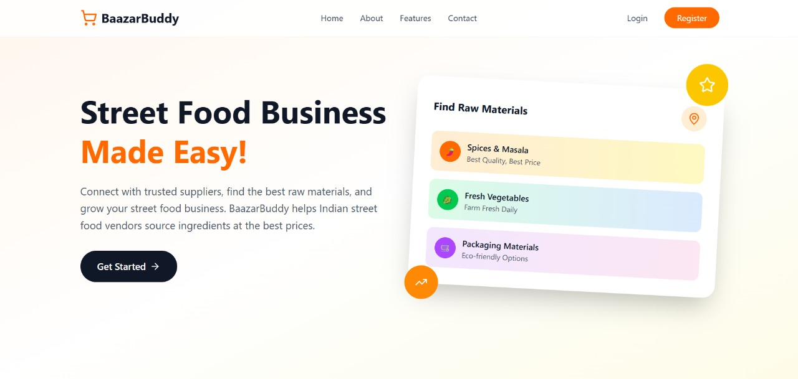
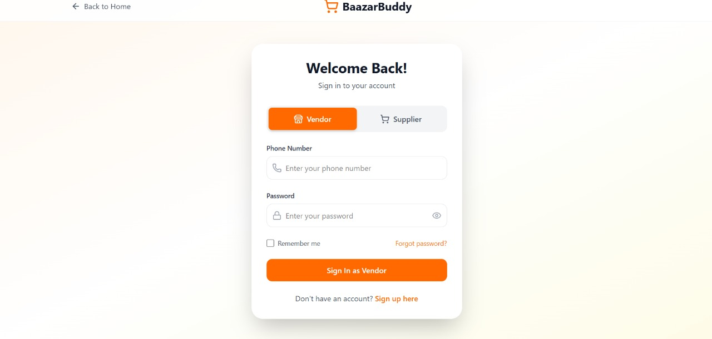

# BazaarBuddy 🛍️

**BazaarBuddy** is a digital platform designed to empower street food vendors and small-scale market sellers. It streamlines raw material sourcing, inventory management, and customer engagement through a mobile-friendly web interface.

---

## 🌟 Key Features

- 📦 **Raw Material Sourcing** – Connect vendors with affordable, reliable suppliers
- 📊 **Sales & Inventory Dashboard** – Track sales and stock in real-time
- 🤖 **Smart Pricing Suggestions** – AI-based price recommendations
- 📍 **Vendor Discovery** – Location-based vendor and customer connection
- 💬 **Customer Feedback System** – Real-time reviews and engagement

---

## ⚙️ Tech Stack

| Layer         | Technology                        |
|---------------|------------------------------------|
| **Frontend**  | React.js, HTML5, CSS3              |
| **Backend**   | Node.js, Express.js                |
| **Database**  | MongoDB / Firebase                 |
| **Authentication** | Twilio                        |
| **Hosting**   | Google Cloud Platform (GCP),Cloudflare Tunnel |

---

## 🛠️ Installation

```bash
git clone https://github.com/das-subho06/BazaarBuddy.git
cd BazaarBuddy
npm install
```

---

## 🚀 Running the Application

```bash
npm run dev
```

Visit `http://localhost:5173` in your browser to access the app.

---

## 📸 Screenshots

>  

---

## 🤝 Contribution Guidelines

Contributions are welcome!

1. Fork the repository
2. Create a new branch: `git checkout -b feature-name`
3. Commit changes: `git commit -m "Added feature"`
4. Push to your branch: `git push origin feature-name`
5. Open a Pull Request

---

## 📃 License

This project is licensed under the [MIT License](LICENSE).

---

## 👥 Team

Developed by:

- **Team Cryptix** – [GitHub](https://github.com/GhostMitra)
- Team Members
    - Subhashree Das
    - Debarghaya Mitra
    - Pratyusha Nandi
    - Rounak Bhattacharya
    - Arka Ghosh Dastider

---

## 📬 Contact

📧 Email
- subhashree1955das@gmail.com
- debarghaya@debarghaya.in
- nandipratyusha6@gmail.com
- rounakiem2024@gmail.com
- arkagdastider@gmail.com


🔗 GitHub
- [https://github.com/das-subho06](https://github.com/das-subho06)
- [https://github.com/GhostMitra](https://github.com/GhostMitra)
- [https://github.com/Prat06-creator](https://github.com/Prat06-creator)
- [https://github.com/CJ7685](https://github.com/CJ7685)
- [https://github.com/arkagdastider](https://github.com/arkagdastider)

---

## 💡 Project Context

BazaarBuddy was developed during **Tutedude’s Web Development Hackathon 1.0**, focused on solving raw material sourcing problems for street food vendors in India. The platform aims to bridge the gap between small vendors and structured supply chains through digital innovation.